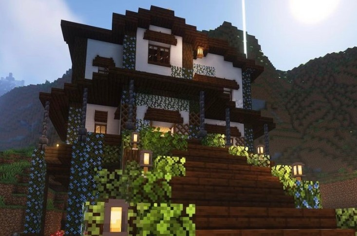

## Ready, Set, GO!!!
Believe it or not, my interest in software engineering was introduced by video games! Around the age of 10, I began playing games such as Super Smash Bros, Minecraft, and Animal Crossing. Video games are a great way to connect with other people, and most importantly it's a great way to be connected to Computer Science! Minecraft is one of the most known ways to be introduced to programming due to its ability to create mods and customize your gameplay by using Java. Currently there are thousands of mods that are available for users around the world to download. I grew up watching YouTubers playing modded Minecraft, and I was constantly curious about how a game like Minecraft could be customizable. 

Making mods in Minecraft could be both complex and difficult because of the amount of problems that can occur during the process of creating the program. Also with Minecraft mods, you must think creatively. You want to create a gamemode that is enjoyable for users and something that everyone needs in their games. Although I have not been able to create a Minecraft mod yet, I would like to create one as a project in order to fulfill the wishes that I had as a child. 

## How Software Engineering can be the solution to all world problems
Wherever we go there is always going to be the use of Software Engineering in some shape of form. From our everyday conveniences—laptops and websites—to the more complex systems—medical diagnostics and the development of artificial intelligence tools—software engineering is required for these things to work. In my senior year of high school, I worked at multiple conservation sites with a non-profit organization called Malama Learning Center. At these conservation sites, there are many ecosystems in Hawai’i that are suffering from coral bleaching, overfishing, and pollution. This is all caused by our society and the constant need for resources and energy. Today, I would like to solve these issues with nothing other than technology. With global issues arising, people are looking into solving these problems with efficient solutions!

## Building confidence with errors 
Computer Science contains multiple concepts that can be very difficult to gain a full understanding of. I can spend hours trying to understand how to fix an error in my code, however, learning how to fix these errors is what helps me improve my programming skills the most. Understanding why an error occurred and gaining the capability to fix that error has allowed me to gain more confidence in programming. Through my studies at the University of Hawaii at Manoa, I hope to not only gain the experience of learning how to code, but to also use the knowledge of Software Engineering to solve real world problems today. Although I may run into many errors while coding, overcoming these errors will bring me closer into becoming a better Software Engineer. 

