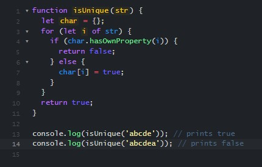

I never knew how simple programming could be until I started learning Javascript! The simplicity and use of Javascript in web development are the leading factors of why so many programmers enjoy coding in Javascript. Although I have experience in other coding languages, such as Java, C, and C++, Javascript is so far my favorite language to learn due to its syntax that makes it significantly different from other languages. 

## Get a taste of Javascript
When I was first learning how to code in Java, I was constantly receiving type errors from the variables and functions that I was using in my code. Since Javascript is a dynamically typed language, the programming language defines variables with let, var, and const which does not restrict a variable to a specific type. This concept is very different from Java but it makes writing code simpler. A lot of programmers, including myself, favor Javascript due to its simplicity with variable types. I can fully understand why Javascript is so commonly used in Software Engineering!

## Dynamically typed programming can save you hours of work!
Javascript has a more flexible and simple syntax compared to other languages such as Java and C. I think this loose syntax can allow programmers to easily create the most efficient applications for their users as soon as possible. Compared to a coding language like Java and C, fixing multiple type errors that are in your program can take some time to fix in order to make your code executable. By coding in Javascript, you can save yourself from writing hundreds of lines of unnecessary code. 

## How to make coding seem as easy as pie
Just like any other sport, in order to get better at a skill you must constantly practice and challenge yourself. If you want to get better at running, then you might run 1 mile on the first week and run 2 miles the second week. This concept of exercising your abilities also applies to coding! Constantly challenging yourself to write a program to solve a coding problem within minutes is a skill that anyone should be proud of. 
  
The concept of solving coding problems or WODS (workout of the day) in a limited amount of time sounded very intimidating at first, however, it also motivated me to constantly test my ability to solve coding problems in an efficient manner. Consistently solving these WODs will become useful to the future generation of Software Engineers because it sets up a stressful environment to be successful in coding interviews. Every Software Engineering company wants an employee who can get the job done efficiently. Although these timed coding problems can create a stressful environment for me to work in, this stress is ultimately meant to improve the fluency of future programmers!!!

