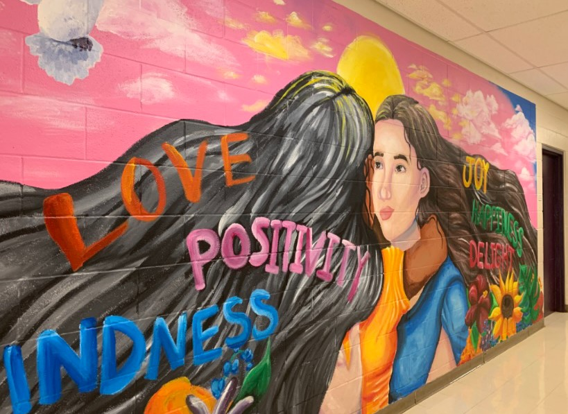

In order to spread kindness to my old high school, I painted a mural in the hallways where students pass by everyday. Painting an anti-bullying mural is a powerful act of art. With the help of my classmate and my art teacher, we designed an art mural from a $500 funding that I received from an art contest. I have been passionate about art ever since middle school. I have been applying to art contests and winning multiple awards for my creativity. With this project, I wanted to give back to my own community and spread kindness to others. 

## Overcoming challenges

Some of the challenges that I have faced with this project was the surface of the wall that the mural was being painted on. The wall had a brick pattern which made some parts of the wall more difficult to paint on. This mural took a whole semester to complete because we could only paint during certain times of the day. During this project, there were times where painting would be enjoyable, but frustrating at the same. Through painting, I was able to practice my creativity and art skills, while also learning how to efficiently work in a team. 

