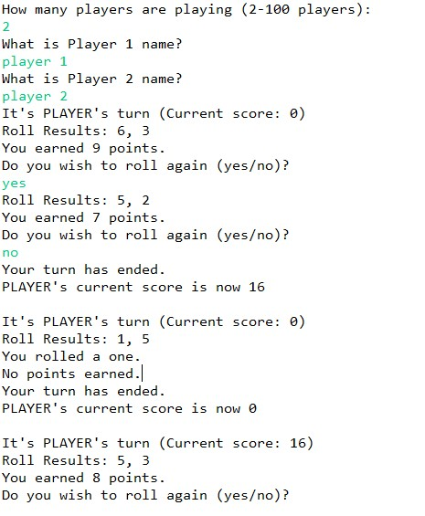

For my ICS 111 assignment, I created a Two Dice Pig Dice game in Java. This was one of the first games that I created while learning how to program. Because I didn’t know much about programming, this assignment was very challenging for me. However, I gained a better understanding of the use of Math.random(), “while” statements, and “if” statements, which are all used to follow the rules of the game and for the program to continue running until there is a winner.  

## Dice and Pigs? What is this game about?
The program first asks the user for the amount of players that are playing and for their names. When it's a player’s turn, they must roll two dice. If the player rolls a 1 on one of their dice, then they don't earn any points. If they roll 1’s on both of the dice, then the player loses all of their points. If the player does not roll any 1’s, then they earn points and they can choose to roll again. However, if they roll doubles on their dice (that are not 1’s), then the player gains points but they are forced to roll again. The first player to 100 points wins the game. 

## So many errors!!!
While creating this program, I have encountered many issues with the “if” statements and “while”  statements. When I was taking ICS 111, I was a beginner at coding, so thinking of the different situations was challenging for me. One of the biggest issues that I had with this assignment was trying to get the game to continue running until there was a winner. Commenting on all of the situations that can occur in the game that has helped me complete this project. This assignment has allowed me to critically evaluate which "if" and "while" statements are needed in order to make this program work. 

