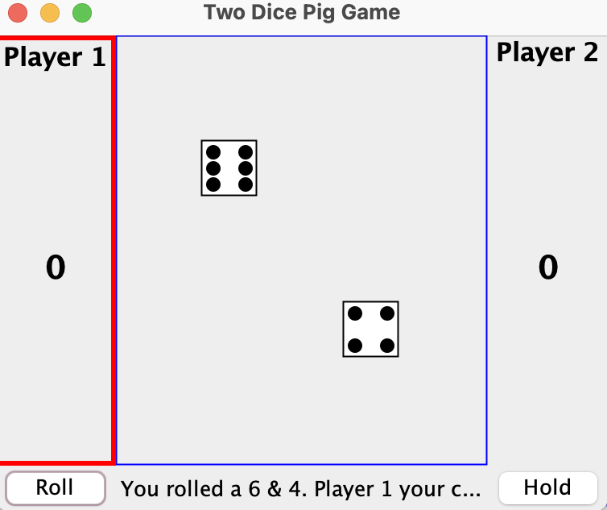

For my ICS 111 assignment, I created a simulation of a Pig Dice game using Java. The program asks the user for the amount of players that are playing and asks for their name. When it's a player’s turn, then they must roll the dice. If they roll a one on their dice, then they don't earn any points. If they roll one’s on both of the dice, then the player loses all of their points. If the player does not roll any one’s then they earn points and can choose to roll again. The first player to 100 points wins the game. 

While creating this program, I have encountered many issues with the “if” statements and some compiling errors. Commenting on all of the situations that can occur for the game has helped me complete this project. This assignment has allowed me to critically evaluate the “if” statements needed in order to make this program work. 
