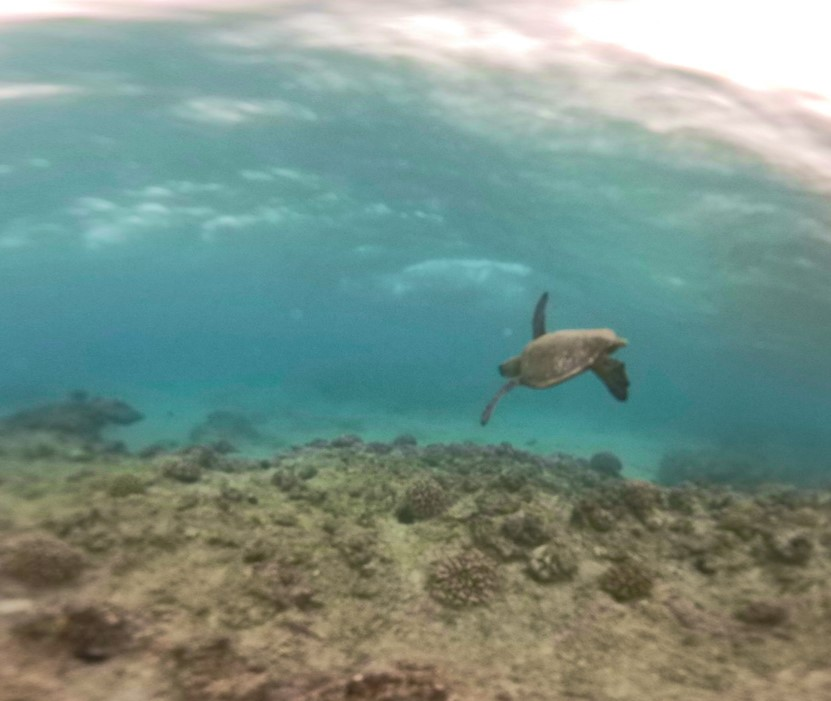

 
I created virtual reality field trips for the different conservation sites around Oahu in order to make learning accessible for individuals who are unable to physically attend because of disabilities, COVID-19, or personal reasons. The virtual reality field trips were meant to recreate these real life learning experiences and also shed light on the environmental issues that are occuring on our island. I created trips for the Nanakuli Wetland, Palehua, and Piliokahe Beach Park. These sites are currently suffering from environmental issues, such as erosion, pollution, and coral bleaching. While on the actual conservation site, I also made time to volunteer by cleaning up these polluted areas and planting Native Hawaiian plants in order to resolve the erosion issue at these sites.

## How I made these Field Trips come to life
In order to gain access to these conversation sites, me and my team collaborated with KUPU and Malama Learning Center, which are both non-profit organizations that focus on environmental conversation around Oahu. I gathered my information from the advisors, in order to gain a better understanding of how their volunteer work is making a positive contribution to the environment. In order to gather high quality photos of these sites, I used a drone and a 360° camera. My team and I also used a website called “Thinglink” to display all of the pictures and information about these sites. At the end of my project, I got the chance to showcase my project at the Hawaii Agriculture Conference and the Hawaii Conservation Conference to other environmental organizations around Hawaii.

Throughout this project, I was able to see the different areas of Oahu that need our help and attention. Learning about the different Native Hawaiian plants and their cultural significance to Hawaiian culture was something that was never taught inside the classroom. These VR field trips served a purpose of bringing environmental awareness to Oahu, and recreating these experiences on a device.

